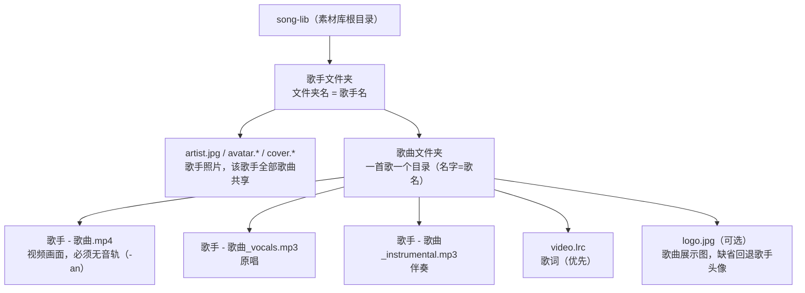

# 桌面系统测试（Electron + Vue3 离线版）

纯本地离线桌面点歌软件，无服务器、无联网。适配 Windows 双屏扩展模式：主屏点歌控制，副屏（电视）全屏播放 MV + LRC 歌词滚动高亮。仅用于个人本地学习，禁止商用 / 分发。

## 技术栈

| 能力 | 选型 |
| --- | --- |
| 桌面框架 | Electron + Vite（electron-vite） |
| 前端 | Vue3 + TypeScript + Ant Design Vue |
| 本地数据库 | sql.js（SQLite 的 WASM 移植版，纯 JS、免原生编译，仅存索引） |
| 歌词解析 | 自研 LRC 解析（无第三方依赖） |
| 进程通信 | Electron IPC（主进程 ↔ 渲染进程双向） |
| 媒体处理 | FFmpeg（仅素材制作，运行时可选） |

## 目录结构

```
karaoke-desktop/
├── electron.vite.config.ts     # 双 HTML 入口（index / player）
├── src/
│   ├── shared/types.ts         # 共享类型 + IPC 通道常量
│   ├── main/                   # 主进程
│   │   ├── index.ts           # 双窗口创建 + IPC 路由 + media:// 协议
│   │   ├── media.ts           # media:// token 映射 + 按扩展名返回正确 mime（支持图片）
│   │   ├── windows.ts         # 窗口创建 + 扩展屏检测
│   │   ├── database.ts        # sql.js (WASM SQLite) song 表（含 artist_avatar 列）
│   │   ├── scanner.ts         # 扫描 D:/song-lib 入库（歌手文件夹名定歌手 / 头像识别）
│   │   └── config.ts          # 配置 JSON 持久化
│   ├── preload/index.ts        # 安全桥接 API（contextBridge）
│   └── renderer/
│       ├── index.html          # 控制窗入口
│       ├── player.html         # 播放窗入口
│       ├── main/               # 控制窗（搜索/歌单/音量/控制）
│       └── player/             # 播放窗（全屏视频 + LRC 歌词）
└── scripts/make-sample-lib.mjs # 生成演示素材库
```

## 快速开始

```bash
# 1. 安装依赖（sql.js 为纯 JS/WASM，无需原生编译，install 不会再因 better-sqlite3 失败）
npm install

# 2. 生成演示素材库（需要 D: 盘；若装了 ffmpeg 会一并生成测试视频）
npm run sample

# 3. 开发模式（会启动两个窗口：控制台 + 播放屏）
npm run dev
```

> Windows 双屏请先在「显示设置」中选择 **扩展这些显示器**（不要镜像/复制）。
> 播放窗会自动定位到扩展屏并全屏；若只有一块屏，则覆盖在主屏上。

## 素材规范（严格遵守，否则歌词错位 / 无法播放）

**单视频 + 双音频方案**：画面只有一个视频文件（无音轨），原唱 / 伴奏是两段独立音频。
切换原唱/伴奏时只换音频流，**视频不重新解码**，彻底解决以前双视频方案切换卡顿的问题。

**目录按歌手组织**：一层是歌手文件夹（名字即歌手名），歌手照片放这一层、全歌手共享；
二层是歌曲文件夹，放画面 + 双音频 + 歌词。

```
D:/
└─ song-lib\                       # 默认素材库（可在「重新扫描」前改配置）
   ├─ 周杰伦\                      # —— 歌手文件夹（名字即歌手名）——
   │  ├─ artist.jpg                # 歌手照片（可选；也认 avatar.* / cover.*，该歌手全部歌曲共享）
   │  ├─ 稻香\                     # —— 歌曲文件夹（一首歌一个目录）——
   │  │  ├─ 周杰伦 - 稻香.mp4              # 【只有画面，必须删掉原生音轨！】H.264 视频流，不带音频
   │  │  ├─ 周杰伦 - 稻香_vocals.mp3      # 原唱音频（MP3；建议用分离出的“人声干声”）
   │  │  ├─ 周杰伦 - 稻香_instrumental.mp3 # 伴奏音频（MP3）
   │  │  ├─ video.lrc                     # 歌词（统一文件名 video.lrc）
   │  │  └─ logo.jpg                      # 歌曲展示图（可选；缺省回退歌手头像）
   │  └─ 晴天\
   │     ├─ 周杰伦 - 晴天.mp4
   │     ├─ 周杰伦 - 晴天_vocals.mp3
   │     ├─ 周杰伦 - 晴天_instrumental.mp3
   │     ├─ video.lrc
   │     └─ logo.jpg
   └─ 薛之谦\
      ├─ artist.jpg
      └─ 绅士\
         ├─ 薛之谦 - 绅士.mp4
         ├─ 薛之谦 - 绅士_vocals.mp3
         ├─ 薛之谦 - 绅士_instrumental.mp3
         ├─ video.lrc
         └─ logo.jpg
```

**目录组织流程图**



> 兼容旧布局：`song-lib/<歌名>/` 平铺结构（媒体文件直接放歌目录）仍可扫描入库，
> 歌手由歌目录内 `artist.txt` 或 LRC `[ar:]` 推断，照片放歌目录。
> **新歌一律用「歌手/歌曲」两级结构**，歌手名和照片只维护一次。

### 文件命名要求
- **视频画面：推荐 `<歌手> - <歌曲>.mp4`**，只承载画面、**必须去掉原生音轨**（`ffmpeg -an` 导出），
  原唱 / 伴奏共用这一个视频 → 切换模式只替换音频，不重新解码视频，不卡顿。
  扫描器也兼容目录内任意 `.mp4`（不依赖基名/前缀），但文件**不能**带 `-vocal(s)` / `-instrumental` / `原唱` / `伴奏` 字样，
  否则会被误判为音轨文件而漏掉画面。
- **原唱音频：推荐 `<歌手> - <歌曲>_vocals.mp3`**（`_vocals` 后缀，MP3）。也兼容目录内任意
  `-vocal(s).mp3` / `_vocal(s).mp3`（分隔符 `-` / `_` 均可）。
- **伴奏音频：推荐 `<歌手> - <歌曲>_instrumental.mp3`**（`_instrumental` 后缀，MP3）。也兼容目录内任意
  `-instrumental.mp3` / `_instrumental.mp3`。
- **歌词文件优先 `video.lrc`**（统一命名）。兼容旧的 `orig.lrc`，以及 `<基名>.lrc` 兜底
  （仅当目录内没有 `video.lrc` / `orig.lrc` 时）。**不再以无规律的「歌名.lrc」为主名**。
- **每个歌目录只允许存在一个 `.lrc`**：若目录里同时存在多个 `.lrc`，
  扫描器按 `video.lrc` → `orig.lrc` → `<基名>.lrc` → 任意首个的顺序选取，可能选错文件导致歌词与视频对不上。
  多余副本请改用 `.bak` / `.baked` 等非 `.lrc` 后缀备份。
- **`video.lrc` 时间戳需与视频对齐**：歌词按视频自身时间轴对时。如官方 MV 前奏较长，
  第一句时间戳应直接落在对应秒数（例如 `[00:34.27]`），无需在程序里额外调偏移。
- **编码 UTF-8**：否则中文乱码。
- **换行符 LF / CRLF 均可**：LRC 解析按行切分，两种换行都不影响时间戳提取。
- **素材白名单**：扫描器只认这几种文件，其余一律不碰——`logo.jpg` / `*.lrc` / `*.mp4` /
  `*_vocals.mp3` / `*_instrumental.mp3`。**视频仅支持 `.mp4`、音频仅支持 `.mp3`**，其它容器（webm/mov/mkv、m4a/aac/wav 等）不再识别。

### 歌手与头像要求
- **歌手名 = 歌手文件夹名（新布局，推荐）**：`song-lib/<歌手>/<歌曲>/` 的一级目录名即歌手名，
  所有歌曲自动归属该歌手，无需每首歌配 `artist.txt`。
- **`artist.txt`（仅旧布局需要）**：平铺结构下，在歌目录放 `artist.txt`，**首行**写歌手名，
  例如 `薛之谦`；扫描器优先用它，其次回退 LRC `[ar:]` 标签。
- **歌手照片（可选，全歌手共享）**：新布局把照片放在**歌手文件夹**一层（`song-lib/薛之谦/artist.jpg`），
  该歌手所有歌曲自动共享同一张头像；旧布局则放歌目录。文件名认：
  `artist.*` / `avatar.*` / `cover.*`（扩展名 `jpg`/`jpeg`/`png`/`webp`/`gif` 均可；
  扫描器优先 `artist.*`，其次 `avatar.*`，再次 `cover.*`）。
  - 照片**不会**原样暴露给前端：扫描器会把它登记进 `media://res/<token>` 安全通道
    （与视频同一机制，真实文件路径不进渲染进程），存入 `song.artist_avatar`，
    由歌曲列表和「歌星」页以 `` 圆形头像显示。
  - 无照片文件时，界面自动用歌手名**首字**作占位，不影响使用。
- **歌曲展示图 `logo.jpg`（可选）**：放在**歌曲文件夹**一层，作为该歌曲专属封面
  （底部栏、歌单行、歌星页卡片用）。缺省时自动回退到歌手头像 `artist.jpg`。
  注意扫描器**只认 `logo.jpg` 这一个名字**，不认 `cover.jpg` / `poster.jpg` 等其它命名。

- 数据库只存**路径**，绝不存视频 / 音频 / 歌词二进制。
- 生成素材（需 ffmpeg，按「歌手 - 歌曲」基名存放）：
  1. 视频画面去音轨：`ffmpeg -i 原视频.mp4 -an -c:v copy "歌手 - 歌曲.mp4"`
  2. 提取原唱音频：`ffmpeg -i 原视频.mp4 -vn -c:a libmp3lame -b:a 192k "歌手 - 歌曲_vocals.mp3"`
  3. 伴奏：UVR5 等工具分离人声后，`ffmpeg -i 伴奏.wav -c:a libmp3lame -b:a 192k "歌手 - 歌曲_instrumental.mp3"`
  （若暂时没有真实伴奏，可先用 `ffmpeg -i "歌手 - 歌曲_vocals.mp3" -acodec copy "歌手 - 歌曲_instrumental.mp3"` 复制一份占位，
   伴奏模式会播原唱，先跑通流程再替换。）


## 打包为 exe

```bash
npm run pack      # 先 build，再用 electron-builder 生成 nsis 安装包到 release/
```

## 已知坑点

- **双屏**：必须「扩展」模式，禁镜像。
- **视频画面必须无音轨**：若视频仍带音频，可能出现两路声音同时响（视频自带音 + 独立音频），
  制作时用 `ffmpeg -an` 去掉原生音轨。
- **素材对齐**：`_vocals.mp3` 与 `_instrumental.mp3` 必须同源同长（同一首歌分离出来的），否则切换时音画错位。
- **LRC 编码**：必须 UTF-8，否则中文乱码。
- **原生模块**：本项目刻意选用 `sql.js`（SQLite 的 WASM 版）而非 `better-sqlite3`，原因是 `better-sqlite3` 在 Electron 中必须源码编译（需 MSVC/Python），极易导致 `npm install` 失败；`sql.js` 纯 JS/WASM，开箱即用。若你本机已装好编译工具且想用 `better-sqlite3`，可参考文档自行替换 `src/main/database.ts`。

## 版权声明

本项目素材仅用于个人本地代码调试、学习研究，属合理使用范围。禁止将打包后的软件、素材包对外分发、上传网络、商用盈利。
